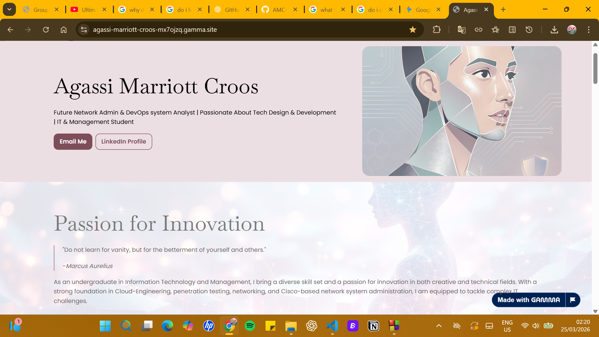
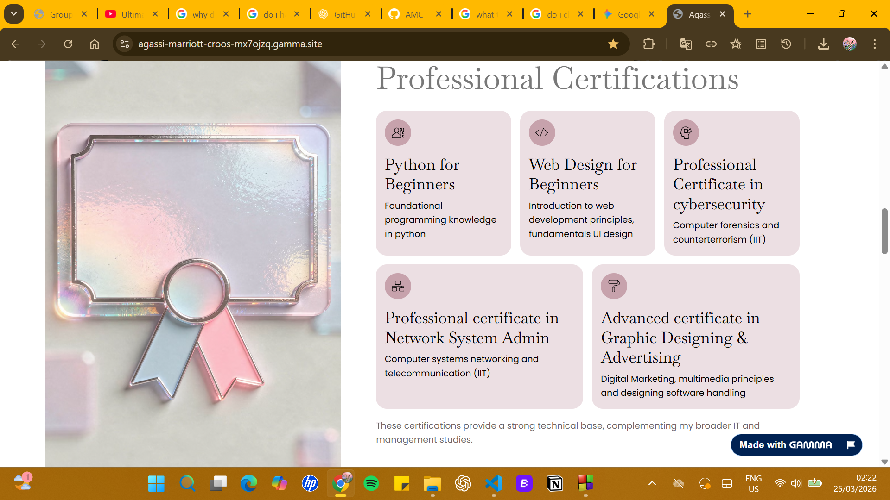
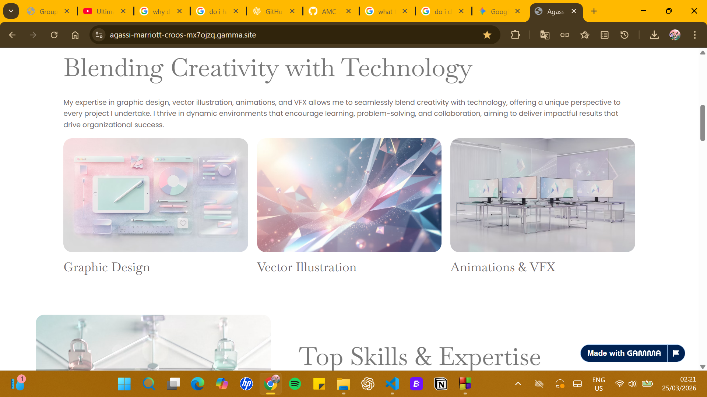
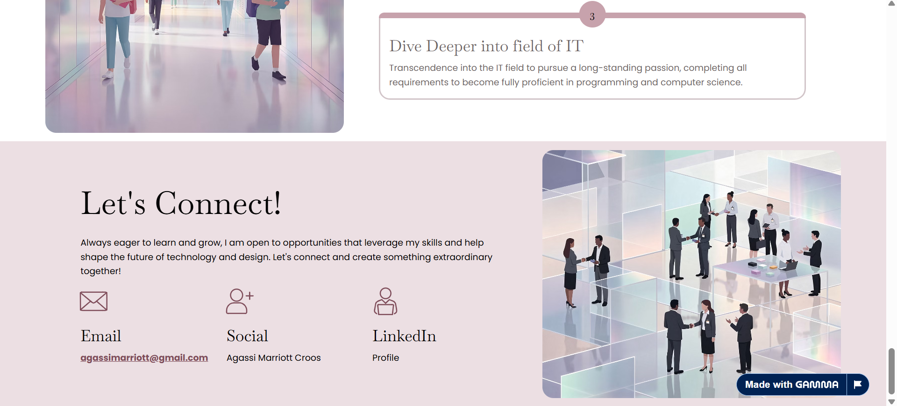

# 🌊 Personal Portfolio Website

> A modern, luxury-inspired personal portfolio website designed to showcase creative work, personal branding, and a clean digital presence.

🔗 **Live Website:**  
https://agassi-marriott-croos-mx7ojzq.gamma.site/

---

## ✨ Overview

This project is a modern, visually immersive personal portfolio website crafted to reflect a strong sense of design, creativity, and professional identity. Inspired by luxury hospitality aesthetics, the interface emphasizes minimalism, elegance, and user-focused presentation.

The portfolio is structured to deliver a seamless browsing experience, highlighting key sections such as personal introduction, featured work, and contact information with clarity and visual balance. Every element is designed to create a refined first impression while maintaining simplicity and usability.

This project serves as both a personal branding platform and a design-focused prototype, demonstrating the ability to conceptualize and present a polished web experience

It reflects:
- 🎨 Creative design thinking  
- 💡 Personal branding  
- 🌐 Clean and structured web presentation  

The goal is to create a **strong first impression** while maintaining simplicity and elegance.

---

## 🖼️ Preview

### 🏠 Home Section


### 🎯 About Section


### 💼 Portfolio Section


### 📞 Contact Section


---

## 🚀 Features

- ⚡ Clean and modern UI
- 🎯 Minimalist layout with strong visual hierarchy
- 📱 Responsive design (mobile-friendly)
- 🎨 Aesthetic typography and spacing
- 🌊 Smooth scrolling experience

---

## 🛠️ Built With

- Gamma AI (Design & Layout Generation)
- Custom styling & structure refinement

---

## 📂 Project Structure

```bash
portfolio-website/
│── index.html
│── assets/
│   ├── images/
│   ├── icons/
│── styles/
│── scripts/
